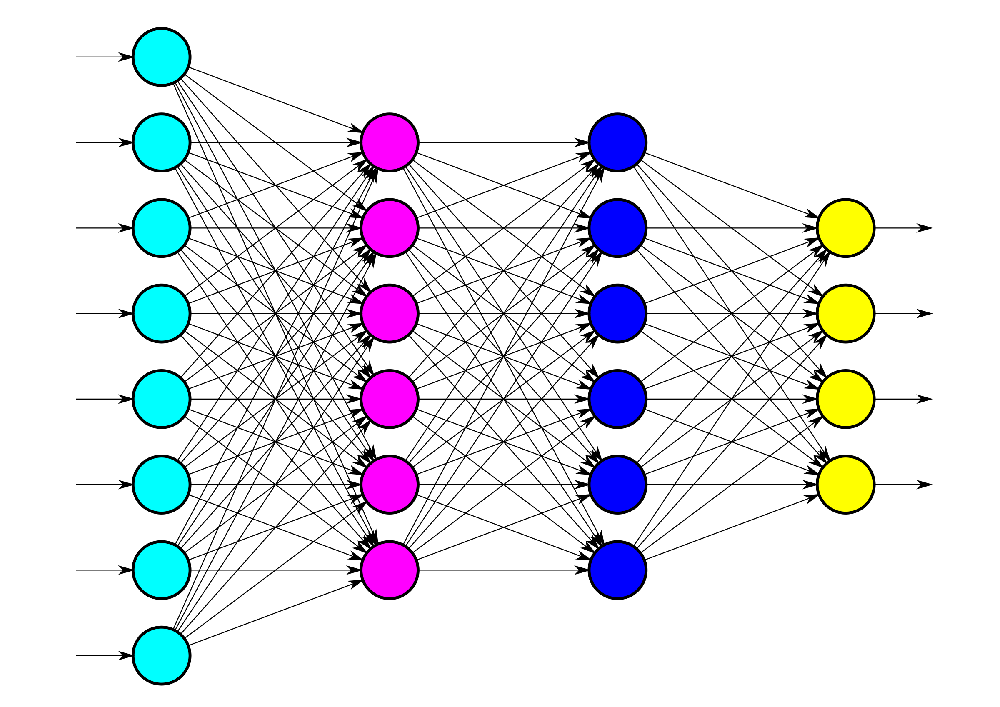

## Domande a risposta multipla (una sola corretta!)

1. La codifica delle immagini RGB è acronimo di...
    - [ ] nulla di specifico: è solo una sigla carina
    - [ ] Rosso, Giallo e Blu
    - [ ] Rosso, Verde e Blu
2.  Una relazione lineare fra due variabili si può esprimere geometricamente
    - [ ] con una retta
    - [ ] con una parabola
    - [ ] con una sinusoide
3.  Nelle reti neurali, qual è il nome che si dà agli *strati* di neuroni che inframezzano l'input e l'output?
    - [ ] strati occulti
    - [ ] strati trascendenti
    - [ ] strati nascosti
4.  Qual è il collegamento fra le reti neurali convoluzionali e le operazioni di convoluzione?
    - [ ] le reti convoluzionali hanno questo nome in quanto operano delle operazioni di convoluzione sia sull'immagine iniziale che sui prodotti degli strati intermedi
    - [ ] non vi è alcun nesso, si utilizza questo nome solamente perché in passato si usavano le convoluzioni per compiti di classificazione in computer vision
    - [ ] il collegamento è dovuto al fatto che si utilizza una convoluzione solamente per ottenere il valore o i valori dell'output finale
5.  Le reti generative avversarie (GAN)...
    - [ ] non consentono di generare immagini
    - [ ] sono composte da una coppia di reti, discriminatore e generatore, in *competizione* l'una con l'altra
    - [ ] sono utilizzate per la classificazione di oggetti
6.  YOLO è una rete per il riconoscimento di oggetti che
    - [ ] è in grado di identificare solamente un oggetto all'interno dell'immagine
    - [ ] può identificare un grosso numero di oggetti all'interno della immagine, ma non può fornirne la posizione
    - [ ] può indentificare un grosso numero di oggetti e fornirne la posizione all'interno dell'immagine

Dato lo schema di una rete neurale sopra, indica

7. Quanti neuroni contiene lo strato di input?
    - [ ] 8
    - [ ] 7
    - [ ] 4
    
8. Quanti neuroni contiene lo strato di output?
    - [ ] 4
    - [ ] 6
    - [ ] 1
    
9. Quanti strati intermedi sono presenti nella rete neurale?
    - [ ] 2
    - [ ] 3
    - [ ] 4

Indica la risposta corretta alle domande qui sotto:

10. La rete neurale in figura
   - [ ] può essere utilizzata per un problema di classificazione a 3 classi
   - [ ] è una rete neurale convoluzionale
   - [ ] produce un output più piccolo dell'input
   - [ ] è una GAN

11. Ammettiamo che, dato un particolare input che chiamiamo x, lo strato di output contenga i seguenti valori, uno per neurone, nell'ordine:
   * classe 1: 0,40
   * classe 2: 0,04
   * classe 3: 0,11
   * classe 4: 0,45
   
    Indica le affermazioni corrette (più di una risposta corretta possibile):
   - [ ] non è possibile determinare a quale classe verrà assegnato x
   - [ ] x verrà assegnato alla classe 1
   - [ ] secondo la rete neurale, è più probabile che x appartenga alla classe 2 piuttosto che alla classe 3
   - [ ] i valori indicati si riferiscono alla probabilità che x venga assegnato alla rispettiva classe indicata dal neurone
   - [ ] x verrà assegnato alla classe 4